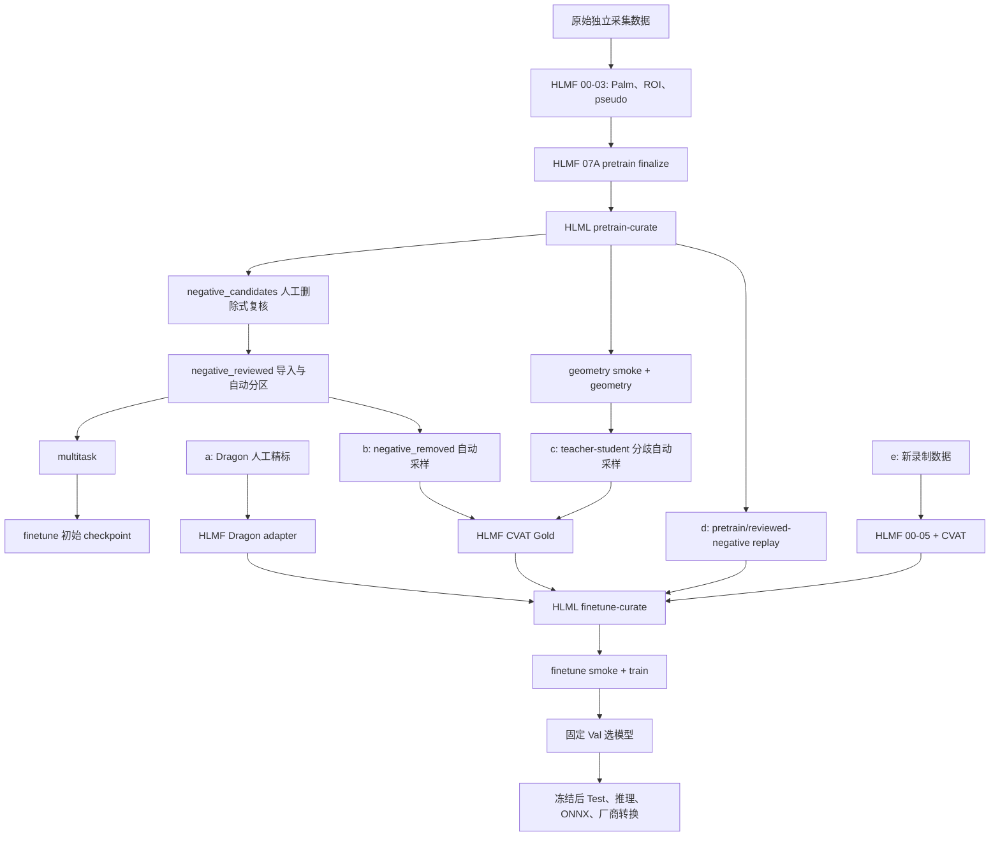

# HLMF + HLML Hand Landmarker 完整训练流程

版本：1.0

发布日期：2026-07-16

文档级别：项目最高级别训练操作规范

适用范围：原始数据制作、pretrain geometry、负例复核、multitask、Gold 数据制作、finetune、评估、推理与导出

## 0. 文档定位与可执行性

本文固化 AetherSign Hand Landmarker 已实现的完整端到端流程。人工操作只包括：

1. 放置、压缩、上传或下载目录；
2. 在 CVAT 中复核程序已经准备好的任务；
3. 修改少量明确的实验 ID 或预算配置；
4. 运行 Make 命令；
5. 查看程序生成的 JSON 报告和可视化。

人工不再编写候选 ID 文本、CSV、JSONL 或 SHA 清单，也不手工拼接训练标签。候选筛选、分层抽样、图片复制、身份恢复、去重、哈希、来源占比和数据聚合全部由程序负责。

本文描述当前已经落地的 HLMF + HLML 端到端能力，并区分已经在服务器完成的数据步骤与仍需操作者执行的步骤：

| 标记 | 含义 |
|---|---|
| `[现有]` | 当前仓库已经支持，可以按命令执行 |
| `[已实现]` | 本轮已经补齐代码、配置和测试，可以按前置条件执行 |
| `[已完成]` | `v2-pretrain-r3` 已完成的历史步骤，不需要重复运行 |
| `[可选]` | 时间或数据允许时再执行，不是当前硬门禁 |

当前最重要的安全边界：

> **`make pretrain-curate-reviewed` 现在只接受 `negative_reviewed`。程序会校验 review manifest、人工保留图和 `train_sources` 原 ROI 三方 SHA，并事务化生成 removed/quarantine；任何额外归档、路径越界、符号链接、文件改写或数量不守恒都会失败。不得把完整 `negative_candidates` 当成复核结果。**

HLML 公开目标统一使用连字符；实际命令是 `make finetune-curate` 与 `make finetune-train`，不提供含义不完整的 `make finetune`。

原训练历史分析文档只保留为历史证据，不再作为后续操作入口。

理解本文细节后，日常执行可直接使用[简易操作手册 v1.0](end_to_end_training_quick_runbook_v1_0.md)。

## 1. 系统边界

### 1.1 HLMF

HLMF（HandLandmarkerFab）是上游数据制作系统，负责：

- 检查原始图片；
- 运行 Palm Detector；
- 按板端相同参数生成 256×256 Hand ROI；
- 运行 Google MediaPipe 产生伪标签草稿；
- 导出和导入 CVAT 标注；
- 将外部人工标注转换为 HLMF 原生 source package；
- 生成带来源、身份、质量和 SHA-256 证据的数据包。

本地仓库：

```text
D:\CICIEC\datasets\HandLandmarkerFab
```

服务器仓库：

```text
/root/HandLandmarksFab
```

### 1.2 HLML

HLML（本仓库）是下游训练系统，负责：

- pretrain 数据提纯；
- 负样本人工复核的身份和 SHA 校验；
- geometry 与 multitask；
- 从训练集自动挖掘 finetune 候选；
- 自动选择 pretrain replay；
- 聚合可选 finetune 来源；
- finetune 训练；
- Val/Test、整图推理、ONNX 导出和转换数据制作。

本地仓库：

```text
D:\CICIEC\MediaPipe\HandLandmarkerLab
```

服务器仓库：

```text
/root/HandLandmarkerLab
```

### 1.3 共享数据根

HLMF finalize 阶段的 `HAND_DATA_ROOT` 与 HLML 的 `HAND_TRAIN_ROOT` 指向同一目录：

```text
/root/autodl-tmp/TrainFab/HLML-2.0
```

两个系统不得同时改写同一个输出。HLMF 写 Gold source package 和 Gold aggregate；HLML 写 b/c selection request、d replay package、最终训练快照、模型和评估结果。

## 2. 核心术语

| 术语 | 本项目中的含义 |
|---|---|
| Hand ROI | Palm 检测结果经过旋转、放大和平移后得到的 256×256 灰度手部小图，是 Hand Landmarker 的直接输入。 |
| pseudo label | Google MediaPipe 自动产生、未经逐图人工确认的伪标签。 |
| Gold | 人工精确标注或经过可信人工流程生成的金标准标签。 |
| Gold ROI | 具有人工确认 presence 和精确 21 点（或人工显式 `no_hand`）的 Hand ROI；“Gold”描述标签质量，不是另一种图片格式。 |
| teacher / student | teacher 是 Google MediaPipe；student 是 HLML 训练的自有模型。 |
| teacher abstention | Google 在一个已有 Palm ROI 上没有输出 21 点。它不等于图中没有手。 |
| confirmed negative | 人工明确确认 ROI 中没有手的真负例。 |
| `negative_removed` | 人工从负例候选中删除的那部分图片。它们大多可能是 teacher 漏检的困难手，但仍只是待标候选，不能直接当 Gold positive。 |
| `negative_quarantine` | 人工保留为背景、但自动重叠门禁发现与已知手冲突的候选。它既不进入 multitask，也不默认进入困难正样本池。 |
| teacher–student disagreement | student 预测与 teacher 伪标签差异很大的 ROI。分歧只表示“值得人工检查”，不表示某一方必然正确。 |
| replay | finetune 时自动回放的一部分 pretrain positive 和已确认 negative，用于防止模型遗忘 pretrain/multitask 能力。 |
| source package | 程序生成的一份可审计数据来源，至少包含标签、来源清单、忽略清单、QC 报告和 SHA。 |
| `source_id` | 一份具体 source package/CVAT task 的唯一目录身份，例如 `negative_removed_gold`、`disagreement_gold`、`dragon_gold_0716_v1`；同一 finetune 工作区内不能重复。 |
| `source_kind` | source 的逻辑类别，用于 HLML 自动发现和应用策略；例如 b 是 `reviewed_hard_gold`、c 是 `disagreement_gold`、Dragon 是 `external_gold`。它由 selection request 或 adapter 生成并由 HLMF 验证，不是人工 Make 参数。 |
| `ignore_for_training` | 人工无法可靠确定目标手或完整 21 点时使用的 CVAT tag。该 ROI 会被记录但不进入训练。 |
| curation | 对来源数据进行审核、去重、抽样和聚合，生成训练 loader 可直接读取的不可变快照。 |
| gate | 硬门禁。任何必须条件失败时程序拒绝继续，不自动放宽。 |
| epoch size | 一个训练 epoch 实际抽取多少条样本。它不一定等于数据集物理行数。 |
| sampling fraction | 各类数据的目标抽样比例。pretrain/multitask 按 batch 取整；finetune 先固定每个 batch 的 Gold/pseudo 数，再按整个 epoch 计算各 sample type 的整数总配额，以便少量 Gold negative 能被均匀分散而不是每个 batch 都重复出现。 |
| NME | Normalized Mean Error，归一化平均关键点误差。本流程用掌宽作分母，使不同大小的手能在同一尺度比较；越小越好。 |
| PCK | Percentage of Correct Keypoints，在指定归一化距离阈值内的关键点比例；越大越好。 |
| Peak | 当前数据来源家族/`dataset_id` 名称的一部分，不是算法术语。“Peak teacher-abstention”只是指 Peak 来源里 Google 未输出 21 点的 ROI。 |
| largest remainder | “最大余数法”：先取各比例配额的整数部分，再把剩余名额依次给小数余数最大的类别，保证整数总数严格守恒。 |
| fail-closed | 条件不完整或证据不一致时直接停止，不猜测、不自动放宽。 |
| `POS_RUNTIME` | Palm 分数达到正式运行阈值，而且 teacher 或人工确认 ROI 中有手的正样本。这里的 Runtime 表示部署时正常会进入 Hand Landmarker 的 Palm ROI。 |
| `POS_LOW_PALM` | Palm 分数低于正式运行阈值，但 teacher 或人工仍确认有手的正样本；它代表 Palm Detector 容易漏掉的困难手。 |
| `NEG_RUNTIME_CANDIDATE` | Palm 达到正式阈值并产生 ROI，但 teacher 没有输出手的“疑似负例”。只有人工复核保留后才是 confirmed negative。 |
| `NEG_LOW_PALM_CANDIDATE` | 低 Palm 分数 ROI 上 teacher 也没输出手的“疑似负例”。低分不等于没有手，仍必须人工复核。 |

## 3. 目标目录布局

```text
${HAND_TRAIN_ROOT}/
├── train_sources/                         # HLMF 交付的原始 Train source，只读
├── eval_sources/                          # 人工 Gold Val/Test source，只读
├── train_pretrain_merged/                 # HLMF 07A pretrain 聚合
├── train_pretrain_curated/<PRETRAIN_ID>/  # HLML pretrain 快照
├── hand_landmarker_reviews/<PRETRAIN_ID>/
│   ├── negative_candidates/               # curate 生成的完整临时候选池
│   ├── negative_reviewed/                 # 人工上传：只包含明确背景
│   ├── negative_removed/                  # 程序生成：人工删除的候选补集
│   ├── negative_quarantine/               # 程序生成：重叠冲突等隔离项
│   ├── review_manifest.jsonl
│   ├── negative_review_decisions.jsonl
│   └── review_report.json
├── finetune/<FINETUNE_ID>/
│   ├── sources/
│   │   ├── gold/                          # HLMF 完成 strict 05 后原子发布的 a/b/c/e
│   │   └── replay/                        # HLML 发布的 d
│   ├── mining/                            # HLML 只写 b/c selection request 和报告
│   ├── cvat/                              # 按 source_id 生成的 CVAT task 包
│   └── hmlf_gold_merged/                  # HLMF 聚合的 Gold 来源
├── train_finetune_merged/<FINETUNE_ID>/   # HLML finetune-curate 最终快照
├── val_merged/
├── test_merged/
├── hand_landmarker_runs/
│   ├── <PRETRAIN_ID>/geometry/
│   ├── <PRETRAIN_ID>/multitask/
│   └── <FINETUNE_ID>/finetune/
└── hand_landmarker_inference/
```

`negative_candidates`、`negative_reviewed` 和 `negative_removed` 都只是审查副本；训练图片仍引用 `train_sources/` 中的原 ROI。这样可以避免重复保存大量图片，并保持训练输入 SHA 不变。

## 4. 完整流程总览



## 5. 已完成进度：`v2-pretrain-r3`

### 5.1 数据与 geometry

以下步骤已经完成：

1. HLMF 制作并聚合多来源 pseudo Train；
2. 将 Train source 放入 `${HAND_TRAIN_ROOT}/train_sources`；
3. 将 Val/Test source 放入 `${HAND_TRAIN_ROOT}/eval_sources`；
4. HLMF 生成 `train_pretrain_merged`、`val_merged`、`test_merged`；
5. HLML 完成 `make pretrain-curate`；
6. HLML 完成 geometry smoke；
7. HLML 完成 `v2-pretrain-r3` geometry、Val 和独立整图推理。

服务器 geometry 状态：

```text
${HAND_TRAIN_ROOT}/hand_landmarker_runs/v2-pretrain-r3/geometry/
```

关键事实：

| 项目 | r3 结果 |
|---|---:|
| geometry Train positive | 59,952 |
| 完成 epoch | 31 |
| best epoch | 11 |
| Val mean pixel error | 22.221 px |
| Val median pixel error | 19.444 px |
| Val P90 / P95 | 39.920 / 46.527 px |
| mean NME | 0.21097 |
| PCK@0.05 / 0.10 / 0.15 | 0.1197 / 0.3040 / 0.4608 |

`training_report.json` 已为 `complete`，best 与 final checkpoint SHA 一致。该 checkpoint 可以作为 multitask 起点和当前 fallback。

Val 共有 1,226 个 Gold positive，没有 negative，因此 `hand_flag_accuracy=1.0` 不能证明模型会拒绝背景。geometry 的 handedness loss coefficient 为 0，原始 BCE 虽会被记录但不参与 total loss 和优化，因此 handedness 指标也不能作为能力证明。

独立整图推理为 192 张原图、217 个 Palm ROI；217 个 ROI 全被 geometry `hand_flag` 接受。52 张无输出图片是 Palm 没有 proposal，不能归因于 Hand Landmarker 在已有 ROI 上拒绝。

### 5.2 本地负例复核结果

服务器原始候选：

```text
48,643 张
├── NEG_LOW_PALM_CANDIDATE     31,573
└── NEG_RUNTIME_CANDIDATE      17,070
```

本地人工保留的明确背景 PNG：

```text
1,049 张
├── NEG_LOW_PALM_CANDIDATE        920
└── NEG_RUNTIME_CANDIDATE         129
```

这 1,049 张已经全量与服务器 `review_manifest.jsonl` 和 `train_sources` 原 ROI 对比：相对路径匹配 `1049/1049`、未知路径 0、保留副本 SHA 不匹配 0、服务器源 ROI 缺失 0、源 ROI SHA 不匹配 0。数据本身已经满足三方身份链，当前阻断仅是程序仍扫描错误目录。

其中 27 张带自动 `NEGATIVE_OVERLAPS_CONFIRMED_HAND` 冲突，预计最终分区为：

```text
原候选 48,643
├── 进入 multitask 的 confirmed negative  1,022
├── negative_quarantine 冲突项               27
└── negative_removed 人工删除候选         47,594
```

预计进入 multitask 的 1,022 张中：

- `NEG_RUNTIME_CANDIDATE`：128；
- `NEG_LOW_PALM_CANDIDATE`：894。

数量满足当前 gate 的总数 500、Runtime 100、Low-Palm 100 门槛。

本地目录还包含两个传输用 ZIP，共约 438 MB：

```text
NEG_LOW_PALM_CANDIDATE/peak_train_0714_dark.zip
NEG_RUNTIME_CANDIDATE/peak_train_0714_dark.zip
```

它们不是候选图片，上传 `negative_reviewed` 时必须留在包外；未来导入程序也会拒绝非图片文件。

## 6. 步骤 0～6：从 HLMF 到 geometry

本节是以后制作新 pretrain ID 时的完整操作。当前 r3 已完成，无需重跑。

### 6.1 HLMF 准备一个原始 Train source `[现有]`

原始图片应与 Val/Test/inference 按完整采集 session 隔离。普通 HLMF source 使用正向 1280×720 灰度图片。

服务器执行：

```bash
cd /root/HandLandmarksFab
conda activate anfab
export HAND_DATA_ROOT=<单个 SOURCE 根目录>

make validate_images_train
make palm_detection_train
make build_roi_train
make run_mediapipe_train
```

核心产物：

```text
<SOURCE>/
├── images/
├── 01_palm/palm_detections.jsonl
├── 02_roi_crops/
│   ├── images/*.png
│   ├── hand_roi_crops_manifest.jsonl
│   └── hand_landmarks_autolabel_draft.jsonl
└── qc/
```

普通 pseudo Train 不需要把所有 ROI 送入 CVAT。

### 6.2 将 source 交付到 TrainFab `[现有]`

将 HLMF 中直接用于训练的 source 复制到：

```text
${HAND_TRAIN_ROOT}/train_sources/<数据集目录>/
```

每个 source 必须保留：

```text
02_roi_crops/images/
02_roi_crops/hand_roi_crops_manifest.jsonl
02_roi_crops/hand_landmarks_autolabel_draft.jsonl
qc/
```

复制后由程序检查图片数量、相对身份和 SHA。不要手工改 JSONL 中的旧绝对路径；HLMF finalizer 使用 `crop_images_dir` 重定位真实图片。

### 6.3 HLMF finalize pretrain `[现有]`

在 `configs/finalize_train.yaml` 登记每个 source 的唯一 `dataset_id`，然后：

```bash
cd /root/HandLandmarksFab
conda activate anfab
export HAND_DATA_ROOT=/root/autodl-tmp/TrainFab/HLML-2.0
make finalize_train_pretrain
```

输出：

```text
train_pretrain_merged/
├── 05_labels/
│   ├── hand_train_catalog_pretrain.jsonl
│   ├── hand_training_labels_pretrain.jsonl
│   └── hand_training_excluded_pretrain.jsonl
└── qc/finalize_train_pretrain_report.json
```

报告必须满足 `status=ok`、`fatal_errors=[]`、图片缺失为 0，并且每个预期 source 的 included 数不是 0。

### 6.4 HLML 更新、提纯和测试 `[现有]`

每次新实验先在 HLML Makefile 设置新的 `HAND_PRETRAIN_ID`，不要复用旧 ID。

```bash
cd /root/HandLandmarkerLab
git pull
conda activate hand-landmarker-tf29

make paths
make compile
make test-unit
make pretrain-curate
make test
```

`pretrain-curate` 输出 geometry positive 快照和完整 `negative_candidates` 审查区。检查：

```text
train_pretrain_curated/<PRETRAIN_ID>/qc/curation_report.json
train_pretrain_curated/<PRETRAIN_ID>/qc/sha256_manifest.json
hand_landmarker_reviews/<PRETRAIN_ID>/review_report.json
```

### 6.5 Geometry smoke 与正式训练 `[现有]`

```bash
make doctor
make inspect-geometry
make pretrain-geometry-smoke
make pretrain-geometry
```

正式完成标志：

```text
hand_landmarker_runs/<PRETRAIN_ID>/geometry/
├── experiment_metadata.json       status=complete
├── training_report.json           status=complete
├── history.json
└── checkpoints/
    ├── best.weights.h5
    ├── last.weights.h5
    └── final.weights.h5
```

### 6.6 Geometry Val、推理和 fallback `[现有]`

先 Val：

```bash
make eval-val-geometry
```

根据 Val 冻结 checkpoint 和方案后再执行：

```bash
make infer-geometry
make export-geometry
```

Test 只在最终方案冻结后运行：

```bash
make eval-test-geometry
```

geometry best 和导出的 ONNX 应在后续实验开始前保留为 fallback。

## 7. 步骤 7：导入人工复核负例

状态：`[已实现]`。满足本节目录、数量和 SHA 前置条件后执行。

### 7.1 人工要做什么

本地权威目录为：

```text
D:\CICIEC\MediaPipe\Trainfab\HLML-2.0\negative_candidates\negative_candidates
```

只上传其中的 PNG 目录树，服务器目标为：

```text
${HAND_TRAIN_ROOT}/hand_landmarker_reviews/v2-pretrain-r3/negative_reviewed/
```

目标目录最外层必须直接是：

```text
negative_reviewed/
├── NEG_LOW_PALM_CANDIDATE/<dataset_id>/*.png
└── NEG_RUNTIME_CANDIDATE/<dataset_id>/*.png
```

不要上传两个 `.zip` 文件，不要增加一层重复的 `negative_candidates/negative_candidates`，不要重命名或重新保存 PNG。

使用 7z 打包时可以排除 ZIP：

```powershell
Set-Location "D:\CICIEC\MediaPipe\Trainfab\HLML-2.0\negative_candidates\negative_candidates"
7z a -t7z ..\v2-pretrain-r3-negative-reviewed.7z .\* -xr!*.zip
7z t ..\v2-pretrain-r3-negative-reviewed.7z
```

可以经夸克网盘中转；7z 压缩、上传、下载和正常解压都不会改写 PNG 的内容，因此不会改变单个 PNG 的 SHA-256。人工无需逐图计算哈希，导入程序会把解压后的 1,049 张图与 review manifest、服务器 `train_sources` 原图做三方 SHA 校验。

把 7z 放到服务器 review root 之外或其根目录后，解压到一个全新的空目录：

```bash
REVIEW_ROOT=/root/autodl-tmp/TrainFab/HLML-2.0/hand_landmarker_reviews/v2-pretrain-r3
ARCHIVE=/root/autodl-tmp/v2-pretrain-r3-negative-reviewed.7z

7z t "$ARCHIVE"
test ! -e "$REVIEW_ROOT/negative_reviewed"
mkdir -p "$REVIEW_ROOT/negative_reviewed"
7z x "$ARCHIVE" -o"$REVIEW_ROOT/negative_reviewed"
find "$REVIEW_ROOT/negative_reviewed" -type f -iname '*.png' | wc -l
find "$REVIEW_ROOT/negative_reviewed" -type f ! -iname '*.png' -print
```

第一条 `find` 应输出 `1049`，第二条不应输出任何路径。若数量或目录层级不对，先修正解压位置，不要运行 curate。人工不删除服务器原 `negative_candidates`，不手工创建 `negative_removed`，不写 decision 文件；这些都由事务化程序完成。

### 7.2 程序必须自动完成什么

当前 `make pretrain-curate-reviewed` 会：

1. 只读取 `negative_reviewed` 作为人工保留集合；
2. 以 `review_manifest.jsonl.candidate_relative_path` 对齐身份；
3. 拒绝未知路径、重复文件、符号链接、非图片文件和 SHA 不符；
4. 再核对 `train_sources` 原 ROI 的路径和 SHA；
5. 将 1,049 个保留项写成有人工证据的 review decision；
6. 将 27 个重叠冲突项写入 `negative_quarantine`；
7. 将原候选中不在 `negative_reviewed` 的 47,594 项写入 `negative_removed`；
8. 生成 `negative_removed_manifest.jsonl`，保存原 crop ID、父 source、相对路径和 SHA；
9. 重建 r3 multitask canonical；
10. 全部产物和哈希成功后，才清理完整 `negative_candidates`，避免占用约 2.2 GB；
11. 支持成功后的幂等复跑，不依赖已经清理的 candidates；
12. 任何一步失败时保持原 candidates 和旧 curated 快照可恢复。

三类集合必须满足守恒：

```text
原候选 = admitted confirmed negative + quarantine + removed
48,643 = 1,022 + 27 + 47,594
```

`negative_removed` 只是高价值待标池。程序不得自动把它标为 positive，因为其中仍可能有模糊手、非目标手或真正背景。

### 7.3 执行命令

```bash
cd /root/HandLandmarkerLab
conda activate hand-landmarker-tf29

make paths
make pretrain-curate-reviewed
make check-multitask-data
```

重点查看：

```text
hand_landmarker_reviews/v2-pretrain-r3/review_report.json
hand_landmarker_reviews/v2-pretrain-r3/negative_removed_manifest.jsonl
train_pretrain_curated/v2-pretrain-r3/qc/curation_report.json
train_pretrain_curated/v2-pretrain-r3/qc/sha256_manifest.json
hand_landmarker_runs/v2-pretrain-r3/multitask_data_gate.json
```

报告中的期望值是 `retained_confirmed_count=1049`、`quarantine=27`、`included_confirmed_negatives=1022`；三者含义不同，不能只看 1,049 就认为全部进入训练。

## 8. 步骤 8：Multitask

状态：训练入口与基于实际负例规模的重复率保护均 `[已实现]`。正式启动 multitask 仍必须先通过人工负例事务和数据 gate。

### 8.1 训练目标

Multitask 从 r3 geometry best 初始化，同时训练：

- landmarks：继续保持 21 点能力；
- hand flag：使用人工确认背景学习拒绝假 ROI；
- handedness：利用已有 handedness 伪标签开始有效训练 handedness head；geometry 阶段该 loss coefficient 为 0，因此这里不是“保持已经学会的能力”。

它不会训练 Palm Detector，也不能恢复 Palm 根本没有产生的 ROI。

### 8.2 自动采样保护

当前预计只有 128 个 Runtime confirmed negative。若保持 `epoch_size=null`，按逐 batch 配额每轮约产生 4,764 个 Runtime-negative draw，平均每条重复约 37.2 次；按总体 8% 粗算约 38 次，容易记住少量背景。

当前配置使用：

```yaml
sampling:
  epoch_size: auto
  epoch_size_upper_bound: 6400
  max_average_cell_draws_per_unique_record: 4.0
  max_expected_row_draws_per_epoch: 8.0
```

第一个上限控制一个 sampling cell 中“平均每条记录被抽多少次”，第二个上限额外保护 cell 内权重最高的单条记录，避免平均值合格但个别行被反复抽中。程序根据 gate 后的真实数量和逐 batch 整数配额自动计算最终 epoch size，并在报告中写出每种 sample type 的预计抽样次数。对当前 1,022 个负例，建议起点约为 6,400 个 draw/epoch；操作者不需要手算或人工删数据。

默认 batch 比例仍可保持：

```text
POS_RUNTIME               72%
POS_LOW_PALM              18%
NEG_RUNTIME_CANDIDATE      8%
NEG_LOW_PALM_CANDIDATE     2%
```

### 8.3 启动训练

确认 `check-multitask-data` 已解析出可行 epoch size 后：

```bash
cd /root/HandLandmarkerLab
conda activate hand-landmarker-tf29

make check-multitask-data
make inspect-multitask
make pretrain-multitask
```

输出：

```text
${HAND_TRAIN_ROOT}/hand_landmarker_runs/v2-pretrain-r3/multitask/
```

完成后先运行 Val 和独立推理：

```bash
make eval-val-multitask
make infer-multitask
make export-multitask
```

接受 multitask 的最低条件：

- `training_report.json` 与 `experiment_metadata.json` 都为 `complete`；
- 起点是 r3 geometry `best.weights.h5`；
- Val landmark mean/P90 相比 geometry 不明显恶化，建议相对退化不超过 3%；
- 固定推理样例的 landmarks 没有明显恶化；
- `hand_flag` 的背景拒绝能力不能仅用 positive-only Val 证明，应结合独立推理中的假 ROI 定性复核。

Test 仍只在最终方案冻结后运行：

```bash
make eval-test-multitask
```

## 9. 步骤 9：准备 finetune 数据

状态：`[已实现]`。五类来源均走统一 source descriptor；可选来源可以缺失，但已经存在的来源必须完整通过 gate。

### 9.1 五类来源总表

| 代号 | 来源 | 是否需要新增人工标注 | 是否允许缺失 | 主要监督 |
|---|---|---:|---:|---|
| a | Dragon 0716 已有人工精标 | 否，只需自动转换和小规模可视化验收 | 是 | Gold landmark + positive presence；handedness 无效 |
| b | `negative_removed` 自动抽样 | 是，CVAT | 是 | 困难 Gold positive/no_hand/ignore |
| c | geometry teacher–student 分歧自动抽样 | 是，CVAT | 是 | 高分歧 Gold landmark/presence |
| d | pretrain positive + confirmed negative replay | 否 | 训练时必须有 | pseudo landmark/handedness + reviewed negative presence |
| e | 新录制的独立随机数据 | 是，CVAT | 是 | 新域 Gold |

`make finetune-curate` 不要求 a～e 全部存在；但已存在的任何 source 必须严格通过内部结构、身份、SHA、标签和泄漏检查。正式训练至少需要一个 Gold source 和 d replay。

### 9.2 a：Dragon 0716 Gold 转换

没有新建平行仓库。Dragon external-Gold adapter 已直接集成到 HLMF，并复用 ROI geometry、projection、source package 和 07A 契约。

Dragon 原始情况：

| 项目 | 实际值 |
|---|---:|
| `images/` JPEG | 8,593 |
| 两份标注共同覆盖图片 | 4,500 |
| 未被 Hand 标注引用的图片 | 4,093，禁止自动纳入 Gold |
| 标注中 `p=0` | 850 张，只进 reject audit，不是 negative |
| 原始人工标注 hand | 5,311 |
| 按 README 唯一匹配成功 | 5,191 ROI |
| 投影后 21 点全部在 ROI 内 | 5,189 ROI |
| 各有 1 点越界 | 2 ROI，自动 ignore，禁止 clamp |

所有被标注 JPEG 的物理尺寸都是 720×1280，EXIF Orientation=6；Dragon 坐标描述的是 EXIF 转正后的 1280×720 图。HLMF 普通 OpenCV 读取会忽略 EXIF，因此不能直接把这批 JPEG送入现有 00/02。

执行命令：

```bash
cd /root/HandLandmarksFab
conda activate anfab

make prepare_dragon_gold \
  DRAGON_RAW_ROOT=/path/to/HandViolenceEnhanced0716/dragon \
  HAND_DATA_ROOT=/root/autodl-tmp/TrainFab/HLML-2.0 \
  HAND_FINETUNE_ID=v2-finetune-r1
```

程序自动：

1. 只读校验 Dragon 原 JPEG 和两份 TXT 的 SHA；
2. 在内存中按 EXIF 方向读取逻辑 1280×720 像素，不生成“转正后”的第二套全尺寸像素副本；同时把 3,565 张实际被标注引用的原 JPEG 优先 hardlink 到 source package 的 `source_images/`（跨文件系统无法 hardlink 时才 copy），用于逐图 SHA 追溯；
3. 按 README 的“21 点中心只落入唯一 Palm bbox”规则匹配 Hand 与 Palm；
4. 使用 `scale=1.8`、`shift_y=-0.1` 构造 256×256 ROI；
5. 将原图 21 点精确投影到 ROI；
6. 生成 5,189 个可训练 Gold 和 2 个 ignored；
7. 将 850 张 `p=0` 图片写入 reject audit；另把 `p>q`、映射歧义、Palm 数不足等各自按原因写入 reject audit，不制造 negative；
8. 自动生成 source package、报告、SHA 和可视化抽检图。

Dragon 没有 handedness。其训练行必须为 `unknown/null`，有效 head 权重为：

```text
presence   = 1
landmark   = 1
handedness = 0
```

它只能提供 positive presence，不能代替 multitask 的 confirmed negative。

Dragon 已是人工精标，不需要再做一次全量 CVAT。人工只需快速查看程序生成的固定 64 张 overlay，确认 EXIF 方向、Palm→Hand 对应和投影没有系统错误。

当前默认 source ID 为 `dragon_gold_0716_v1`，重点查看：

```text
finetune/<FINETUNE_ID>/sources/gold/dragon_gold_0716_v1/finetune_source.json
finetune/<FINETUNE_ID>/sources/gold/dragon_gold_0716_v1/qc/gold_source_report.json
finetune/<FINETUNE_ID>/sources/gold/dragon_gold_0716_v1/qc/overlays/
finetune/<FINETUNE_ID>/sources/gold/dragon_gold_0716_v1/qc/source_images_sha256.jsonl
```

### 9.3 b：从 `negative_removed` 自动选择困难候选

程序读取经过 SHA 认证的 `negative_removed_manifest.jsonl`，不按文件名猜身份，也不使用 HLMF `tools/downsample.py`。

默认人工预算：

```text
最多 300 ROI
NEG_RUNTIME : NEG_LOW_PALM = 60% : 40%
```

选择器按 `dataset_id × sample_type × source sequence` 分层；这里的 source sequence 指同一段视频或连续拍摄序列。程序先限制同一原图/连续片段重复，再使用固定 salt（写入配置、保证重复运行选中同一批数据的固定字符串）的哈希稳定抽样。Runtime teacher-abstention 优先级较高，但每个来源仍受上限控制。

这些图不能直接作为 positive。程序只负责自动准备 CVAT 包；人工最终可以标成：

- 21 点 Gold positive；
- 显式 `no_hand`；
- `ignore_for_training`。

### 9.4 c：自动选择 teacher–student 高分歧样本

程序对 r3 curated geometry positive 批量运行 r3 geometry best，并与同 ROI 的 teacher pseudo 比较。

默认人工预算：

```text
最多 300 ROI
POS_RUNTIME : POS_LOW_PALM = 50% : 50%
```

主要分歧量：

```text
landmark NME = 21点平均(student与teacher距离)
               / max(teacher的掌宽, 0.05)

collapse = abs(log(student骨架总长度 / teacher骨架总长度))
```

其中 teacher 掌宽固定定义为 landmark 5 到 landmark 17 的距离，骨架总长度固定使用 MediaPipe 的 20 条标准连接边。程序同时记录 mean/P90/max NME、student hand flag、teacher/student bbox 和骨架 spread；geometry 的 hand-flag head 尚未经过 negative 训练，因此当前分歧总分中的 `hand_flag_error` 权重固定为 0。只有改用经过验证的 multitask checkpoint 后，才允许显式启用该分项。高分仅表示值得标注，不直接判定 teacher 或 student 错。

### 9.5 b/c 的 HLMF 与 CVAT 流程

b/c 的 ROI、原 manifest 和原 MediaPipe draft 已经存在。自动 materializer 会恢复它们并按来源生成 task；无需重跑 HLMF 03。重跑 teacher 既浪费时间，也可能因 MediaPipe 版本变化破坏可复现性。

已实现流程：

```text
HLML 自动选样
  → HLMF 自动恢复 subset manifest/draft/图片并核 SHA
  → HLMF 04 批量导出 CVAT task
  → 人工 CVAT
  → HLMF 05 strict import
  → HLMF 原子发布 finetune Gold source package
```

执行命令：

```bash
# HLMF：为冻结的 pretrain 标签发布一次只读父源索引；不会改写 r3 JSONL
cd /root/HandLandmarksFab
conda activate anfab
export HAND_DATA_ROOT=/root/autodl-tmp/TrainFab/HLML-2.0
export HAND_PRETRAIN_ID=v2-pretrain-r3
make build_pretrain_source_registry

# HLML：生成 b/c selection request 和 d replay；不会发布半成品 Gold source
cd /root/HandLandmarkerLab
conda activate hand-landmarker-tf29
make prepare-finetune-sources

# HLMF：将 b/c 按 source_id 自动变成 CVAT 包
cd /root/HandLandmarksFab
conda activate anfab
export HAND_DATA_ROOT=/root/autodl-tmp/TrainFab/HLML-2.0
export HAND_FINETUNE_ID=v2-finetune-r1
make export_finetune_gold \
  FINETUNE_SOURCE_ID=negative_removed_gold \
  FINETUNE_SOURCE_MODE=selection_subset
make export_finetune_gold \
  FINETUNE_SOURCE_ID=disagreement_gold \
  FINETUNE_SOURCE_MODE=selection_subset
```

`build_pretrain_source_registry` 固定生成：

```text
train_pretrain_merged/qc/pretrain_source_registry.jsonl
train_pretrain_merged/qc/pretrain_source_registry_report.json
```

报告必须是 `status=ok` 且 `rows>0`。registry 中保存的是生成服务器上的绝对父 manifest、draft、ROI 路径及其 SHA；如果中央数据根迁移，必须在新位置重新运行 registry 命令，不能手改或从本地复制旧 registry。

随后，HLML 固定生成两个请求文件：

```text
finetune/<FINETUNE_ID>/mining/negative_removed_gold/selection_request.jsonl
finetune/<FINETUNE_ID>/mining/disagreement_gold/selection_request.jsonl
finetune/<FINETUNE_ID>/mining/negative_removed_gold/selection_report.json
finetune/<FINETUNE_ID>/mining/disagreement_gold/selection_report.json
finetune/<FINETUNE_ID>/mining/prepare_finetune_sources_report.json
finetune/<FINETUNE_ID>/sources/replay/pretrain_replay/finetune_source.json
```

两个 selection report 的 `actual_selected` 应与各自 request 行数一致；总报告记录输入和输出 SHA；replay descriptor 负责认证 d 的标签、图片根和来源。任一报告缺失或状态异常时停止，不要让 HLMF 猜测请求内容。

这里的 `FINETUNE_SOURCE_ID` 必须与请求目录名完全相同。b 请求行内自带 `source_kind=reviewed_hard_gold`，c 请求行内自带 `source_kind=disagreement_gold`；HLMF 会严格验证并自动采用这个字段。因此 Makefile/CLI 没有 `FINETUNE_SOURCE_KIND` 参数，人工也不应另行传入。`selection_subset` 默认按 `<workspace>/mining/<FINETUNE_SOURCE_ID>/selection_request.jsonl` 找请求；只有使用经过审计的非标准位置时才需要 `FINETUNE_SELECTION_REQUEST` 覆盖。

导出成功后，b、c 是两个相互独立的 task 包：

```text
finetune/<FINETUNE_ID>/cvat/negative_removed_gold/
├── 02_roi_crops/images/
├── cvat_autolabel.xml
├── task_descriptor.json
└── qc/cvat_export_stats.json
finetune/<FINETUNE_ID>/cvat/disagreement_gold/
├── 02_roi_crops/images/
├── cvat_autolabel.xml
├── task_descriptor.json
└── qc/cvat_export_stats.json
```

人工分别在 CVAT 创建 image task，上传对应 `02_roi_crops/images/`，再导入该包的 `cvat_autolabel.xml` 作为初始标注。不要把 b/c 图片混在同一 task，不要改图片文件、`task_descriptor.json` 或 QC 文件。

人工在 CVAT 中只处理程序生成的任务。每张非 ignore 图片必须明确处于以下状态之一：

1. 一个恰好 21 点的 skeleton，并标 Left/Right；
2. 一个恰好 21 点的 skeleton，并显式标 unknown handedness；
3. 显式 `no_hand`；
4. `ignore_for_training`。

“没有 skeleton 也没有 no_hand/ignore”必须让 strict importer 报错，不能静默变成 Gold negative。

Finetune 专用 HLMF 04 不得把 teacher 的 Left/Right tag 预填成监督标签；人工必须为每个 positive 显式选择 Left、Right 或 unknown handedness。无 handedness tag 或多个 handedness tag 同样 fatal。

复核完成后，从每个 CVAT task 导出 `CVAT for images 1.1`。分别命名为 `reviewed.xml`，放回对应 task 根目录（与 `task_descriptor.json` 同级）后：

```bash
export HAND_DATA_ROOT=/root/autodl-tmp/TrainFab/HLML-2.0
export HAND_FINETUNE_ID=v2-finetune-r1
make import_finetune_gold
make finalize_train_finetune
```

只有 HLMF strict 05 完整成功后，程序才把 b/c 的最终 `finetune_source.json` 原子发布到 `sources/gold/`。HLML 早先写在 `mining/` 中的 selection request 不是 source，HLMF discovery 不会把未完成 CVAT 的半成品当成坏 source。

`finalize_train_finetune` 根据 `finetune/<FINETUNE_ID>/sources/gold/*/finetune_source.json` 自动发现并聚合实际存在的 Gold source；人工不逐个编辑 YAML source 列表。HLMF finalizer 不猜测本次原本打算启用哪些可选 role；随后 HLML 的 `check-finetune-sources` 才依据 `configs/curate_finetune.yaml` 把缺失可选 role 记录为 `absent_optional`。

Gold aggregate 输出是不可变目录；若 `hmlf_gold_merged/` 已存在，finalizer 会拒绝覆盖。不要手工删目录后重跑来改变已经使用的数据；需要不同来源组合时创建新的 `HAND_FINETUNE_ID`。

HLMF 的 Gold 聚合写入：

```text
${HAND_DATA_ROOT}/finetune/<FINETUNE_ID>/hmlf_gold_merged/
├── hmlf_gold_aggregate.json
├── 05_labels/
│   ├── hand_train_catalog_finetune.jsonl
│   ├── hand_training_labels_finetune.jsonl
│   └── hand_training_excluded_finetune.jsonl
└── qc/finalize_train_finetune_report.json
```

它只聚合 a/b/c/e 的 Gold source，并保留各 `dataset_id`；不会覆盖 HLML 最终的 `train_finetune_merged/<FINETUNE_ID>`。HLML 随后再把这份 Gold aggregate 与 d replay 合并。

HLMF Gold aggregate canonical 是 a/b/c/e **唯一的训练 Gold 标签输入**。HLML 读取单源 descriptor 只用于核对来源、head policy、权重和 SHA，不会再次 append 单源 raw Gold 行。

人工不写 subset ID、CSV、JSONL，不手工合并不同 source。

### 9.6 d：自动选择 pretrain replay

d 不进入 CVAT。程序直接从 r3 curated 数据生成 finetune replay 索引，图片继续引用只读 `train_sources`。

默认规则：

- 最大 10,000 条；
- 优先保留全部可用 confirmed negative；
- 其余名额从 geometry positive 中补齐；
- positive 按 `POS_RUNTIME:POS_LOW_PALM=75:25`；
- 按 source 可用量平方根自动分配，再执行每 source 上限；
- `prepare-finetune-sources` 在 replay 中保留足够的 parent ID；Gold 完成后，`finetune-curate` 执行 Gold-over-replay 去重，并把被覆盖的 replay 记为 `SUPERSEDED_BY_GOLD`；
- 固定 seed/salt，输入 SHA 不变时重复运行得到相同选择。

平方根分配的含义：一个来源有 4 倍候选时只获得约 2 倍配额，避免最大来源完全支配，同时又不强迫极小来源获得不合理的等额配额。

### 9.7 e：新录制独立 Gold `[可选]`

新数据必须与现有 Train、Val、Test、inference 按完整 session 隔离。先在独立 raw source root 执行 HLMF 00～03，只让程序生成 Palm、ROI 和 teacher draft：

```bash
E_SOURCE_ROOT=/root/autodl-tmp/TrainFab/HLML-2.0/finetune/v2-finetune-r1/raw/new_recorded_gold_v1
export HAND_DATA_ROOT="$E_SOURCE_ROOT"

make validate_images_train
make palm_detection_train
make build_roi_train
make run_mediapipe_train
```

然后切回共享实验根，使用与 b/c 相同的 finetune 专用 04。该入口会去除 teacher 自动填入的 handedness，并要求人工对每个 positive 显式选择 Left、Right 或 unknown：

```bash
export HAND_DATA_ROOT=/root/autodl-tmp/TrainFab/HLML-2.0
export HAND_FINETUNE_ID=v2-finetune-r1

make export_finetune_gold \
  FINETUNE_SOURCE_MODE=native_existing \
  FINETUNE_RAW_SOURCE_ROOT="$E_SOURCE_ROOT" \
  FINETUNE_SOURCE_ID=new_recorded_gold_v1
```

人工在 CVAT 完成 21 点、presence、ignore 和 handedness 决策，把 XML 放回 task descriptor 指定的 `reviewed.xml` 后：

```bash
make import_finetune_gold FINETUNE_SOURCE_ID=new_recorded_gold_v1
```

该命令必须走 finetune strict 05，并在检查全部 task、图片和 SHA 后原子发布 `sources/gold/new_recorded_gold_v1`；不能改用普通 `import_cvat_train`。若时间不足没有 e，后续 finetune curate 应记录 `absent_optional`，而不是失败。

## 10. 自动采样配置

状态：`[已实现]`。

候选人工预算和 replay 上限由 `configs/prepare_finetune_sources.yaml` 控制。下面是与当前文件一致的可调部分；输入路径、模型和输出工作区仍保留在正式配置中：

```yaml
schema_version: 1

selection:
  negative_removed:
    enabled: true
    max_items: 300
    per_dataset_max: 100
    sample_type_fractions:
      NEG_RUNTIME_CANDIDATE: 0.60
      NEG_LOW_PALM_CANDIDATE: 0.40
    salt: negative_removed_gold_v1

  teacher_student:
    enabled: true
    max_items: 300
    per_dataset_max: 100
    sample_type_fractions:
      POS_RUNTIME: 0.50
      POS_LOW_PALM: 0.50
    score_weights:
      mean_nme: 1.0
      p90_nme: 0.5
      collapse_log_ratio: 0.5
      hand_flag_error: 0.0
    salt: geometry_disagreement_v1

  pretrain_replay:
    enabled: true
    max_records: 10000
    include_all_confirmed_negatives: true
    positive_fractions:
      POS_RUNTIME: 0.75
      POS_LOW_PALM: 0.25
    salt: finetune_replay_v1
```

按来源可用量开平方、再用最大余数法取整数配额，是程序的固定算法，不是额外 YAML 开关；当前配置不接受 `allocation` 或 `one_per_source_group_first` 这类占位字段。

如果可选 Gold 来源缺失，程序只在实际存在且通过 gate 的 Gold role 之间重新归一化各自的 `target_gold_weight`，并把原始目标权重、重归一化结果和实际 draw 写入报告。

操作者通常只需要调整：

- `enabled`：是否启用某类来源；
- `max_items`：最多送多少 ROI 给 CVAT；
- `per_dataset_max`：单一来源上限；
- `max_records`：replay 最大行数。

不需要理解或修改程序生成的候选清单。

Gold 来源权重只在 `configs/curate_finetune.yaml` 定义，配置形状与程序契约保持一致：

```yaml
sources:
  dragon_gold:
    target_gold_weight: 0.60
  negative_removed_gold:
    target_gold_weight: 0.20
  disagreement_gold:
    target_gold_weight: 0.15
  new_recorded_gold:
    target_gold_weight: 0.05
```

这里的 `dragon_gold` 等键是 HLML 的逻辑 role；程序根据各 role 的 `discover_kind` 匹配 HLMF descriptor 中的 `source_kind`，并不要求物理 `source_id` 恰好等于 role 名。例如 Dragon 的实际 source ID 可以是 `dragon_gold_0716_v1`，其 kind 必须是 `external_gold`。

`gold_fraction`、`epoch_size` 和 tier 内 sample type 比例只在 `configs/train_finetune.yaml` 定义。三个配置各有唯一职责，gate 会检查 curation manifest 与 train config 是否一致，不从 selection config 隐式继承训练比例。

## 11. 步骤 10：`finetune-curate`

状态：`[已实现]`。

### 11.1 准备实验身份

HLML Makefile 已同时导出两个独立实验 ID；步骤 10 继续复用：

```make
HAND_PRETRAIN_ID := v2-pretrain-r3
HAND_FINETUNE_ID ?= v2-finetune-r1
```

`HAND_PRETRAIN_ID` 指定 replay 和初始 checkpoint；`HAND_FINETUNE_ID` 指定本次 finetune 数据快照、run、评估、推理和导出。尝试另一种 finetune 配置时只增加新的 finetune ID，不重做 pretrain。

人工只需创建 inbox 根目录；各自动化命令会创建 source 子目录：

```bash
ROOT=/root/autodl-tmp/TrainFab/HLML-2.0
mkdir -p "$ROOT/finetune/v2-finetune-r1/sources/gold"
mkdir -p "$ROOT/finetune/v2-finetune-r1/sources/replay"
```

将外部 source package 放入 `sources/`；a/b/c/d 的程序产物可以直接写入，无需再次复制。

### 11.2 聚合命令 `[已实现]`

```bash
cd /root/HandLandmarkerLab
conda activate hand-landmarker-tf29

make finetune-curate
make check-finetune-data
make inspect-finetune
```

`finetune-curate` 的 Make 依赖会先运行 `check-finetune-sources`，认证 HLMF aggregate、所有已发现的 Gold descriptor 和 d replay；失败时不会开始写最终快照。两级门禁报告固定为：

```text
finetune/<FINETUNE_ID>/qc/finetune_sources_gate.json
hand_landmarker_runs/<FINETUNE_ID>/finetune_data_gate.json
```

第一份是聚合前的来源门禁，第二份是聚合后的不可变快照、采样计划和初始 multitask checkpoint 门禁。两份都必须是 `status=ok`，不能只看 `finetune-curate` 命令有没有返回文件。

输出：

```text
train_finetune_merged/<FINETUNE_ID>/
├── 05_labels/
│   ├── hand_training_labels_finetune.jsonl
│   ├── hand_training_ignored_finetune.jsonl
│   └── hand_training_labels_finetune_smoke.jsonl
├── audit/
│   ├── source_catalog.jsonl
│   ├── selection_catalog.jsonl
│   ├── excluded_and_superseded.jsonl
│   └── finetune_smoke_selection.jsonl
└── qc/
    ├── curation_report.json
    └── sha256_manifest.json
```

### 11.3 可选来源门禁

缺失 source 的规则：

- `required: false` 且目录不存在：记录 `absent_optional`，允许继续；
- `enabled: false`：记录 `disabled`，允许继续；
- source 目录一旦存在：必须完整严格检查，不能因为它是可选来源而忽略内部错误。

总体最低条件：

- 至少一个可训练 Gold source；
- 至少 256 个 Gold positive；
- d replay 存在；
- 所有已存在 source package 的 descriptor、标签、图片和 SHA 一致；
- `ignore_for_training` 只出现在 ignored 输出；
- Gold/pseudo 重复时 Gold 自动覆盖；
- 两份 Gold 命中同一 `parent_global_crop_id` 时优先视为同一 ROI；缺 parent ID 时再依次使用 global ID、ROI SHA 和归一化像素 SHA 对齐。相同标签确定性去重并记录证据；presence、21 点或 handedness 冲突时 fail，不能靠新 subset ID 绕过；
- 与固定 Val/Test 的 global ID、source group、图片 SHA 和归一化像素 SHA 无泄漏；
- Dragon unknown handedness 的记录级 handedness loss weight/mask 和该 head 的 loss contribution 为 0；整条样本的 `sampling_weight` 仍必须大于 0，landmarks 与 presence 仍正常训练；
- replay 中的 pseudo negative 必须带 pretrain `INCLUDE_CONFIRMED_NEGATIVE` decision、reviewer/time/method/SHA；
- b/c/e 中的 Gold `no_hand` 必须带 strict CVAT 的显式 `no_hand`、`supervision_tier=gold`、`annotation_provenance=human_gold` 和 source descriptor SHA。它不需要伪造 pretrain review 字段；
- sampling cell 与 batch 配额可行。

## 12. 步骤 11：Finetune 训练

状态：底层 trainer、正式配置、Make 路由、smoke、eval、infer 与 export 均 `[已实现]`。

### 12.1 默认训练策略

下面只是当前训练策略摘要，不是可独立复制执行的完整 YAML；正式 `configs/train_finetune.yaml` 还包含 environment、完整 model/targets/data、loss、augmentation、Val/Test inspection、runtime 和允许图片根。

```yaml
stage: finetune

training:
  epochs: 40
  batch_size: 64
  initial_checkpoint: <v2-pretrain-r3 multitask best>
  gold_fraction: 0.35
  optimizer:
    learning_rate: 1.0e-5
  early_stopping:
    enabled: true
    monitor: val_landmark_mae
    mode: min
    patience: 8

sampling:
  epoch_size: 12000
  quota_scope:
    supervision_tier: per_batch_half_up
    sample_type: per_epoch_largest_remainder
  batch_distribution: deterministic_balanced_deficit
  sample_type_fractions_by_tier:
    gold:
      POS_RUNTIME: 0.70
      POS_LOW_PALM: 0.20
      NEG_RUNTIME_CANDIDATE: 0.07
      NEG_LOW_PALM_CANDIDATE: 0.03
    pseudo:
      POS_RUNTIME: 0.72
      POS_LOW_PALM: 0.18
      NEG_RUNTIME_CANDIDATE: 0.06
      NEG_LOW_PALM_CANDIDATE: 0.04
  missing_cell_policy:
    gold: redistribute_within_tier
    pseudo: fail
  rare_cell_policy:
    gold: cap_fraction_then_redistribute_within_tier
    pseudo: fail
    max_average_draws_per_unique_record: 4.0
    max_expected_row_draws_per_epoch: 8.0
```

Gold 通常主要是正样本，但 b/c/e 中人工显式标出的 `no_hand` 也应以受控比例参与训练，不能被浪费。程序先保证每个 batch 的 Gold/pseudo 总数，再对整个 epoch 计算每个 tier×sample type 的整数 draw 总量。Gold 某类 negative 不存在时配额回流到 Gold positive；数量过少时先把该 cell 的 epoch 总 draw 限制到重复率上限，再把剩余配额回流到同 tier positive，并把少量 negative draw 确定性地分散到不同 batch。不能继续用“每个 batch 对 7% 取整为 1”的旧方式，否则一个稀有 Gold negative 会在几乎每个 batch 重复出现。pseudo replay 同时复习 confirmed negative。

finetune 的 Val 仍使用原 `val_merged`，Test 仍使用原 `test_merged`。当前 Val/Test 主要用于公平比较 landmarks；它们没有 negative，不能证明 presence rejection。

未来可以另建含 negative 的新版 Val/Test 来评估 presence，但必须把它视为新的评估协议，并从新的 pretrain 实验 ID 建立 geometry→multitask→finetune 完整对照；不能把新版指标与当前 r3 的旧 Val/Test 指标直接横比。本轮不做这项扩展。

### 12.2 Finetune smoke 的数据和硬门禁

`finetune-curate` 必须从最终快照确定性生成并认证：

```text
train_finetune_merged/<FINETUNE_ID>/05_labels/hand_training_labels_finetune_smoke.jsonl
```

固定 256 行的建议组成是：Gold 80 个 positive、最多 16 个 Gold `no_hand`（不足时回填 Gold positive）、pseudo positive 96 个、两类 confirmed pseudo negative 各 32 个。选择器按 source/sequence 去近重复；若存在 positive unknown-handedness，至少固定选入 1 个并检查其 handedness mask 为 0；若不存在则报告 `not_applicable`，不能因 Dragon 或其他 unknown 来源是可选项而失败。所有 256 行及 selection report 的 SHA 都写入 `finetune_curation_v1` manifest，人工不准备 smoke 清单。

`configs/train_finetune_smoke.yaml` 必须从正式 full config 继承。checker 同时读取 smoke config 与 `configs/train_finetune.yaml`，认证模型接口/depth、targets、loss、输入契约、初始 multitask checkpoint SHA、curation manifest SHA 和 full/smoke labels SHA。只允许 smoke 覆盖实验名、run dir、epochs、batch/epoch size、关闭 augmentation/validation，以及把 checkpoint、early stopping、learning-rate schedule 三者统一改为训练期 `loss` monitor；不能关闭 validation 后仍继承不存在的 `val_landmark_mae` monitor，也不能用旧 smoke 放行后来改过的 full config。

在完整 256 行上使用 best checkpoint 无增强顺序推理，硬门禁建议固定为：

```yaml
smoke_gate:
  expected_records: 256
  maximum_mean_landmark_mae: 0.02
  maximum_p90_landmark_mae: 0.04
  maximum_max_landmark_mae: 0.10
  maximum_hand_flag_bce: 0.08
  minimum_hand_flag_accuracy: 0.98
  maximum_handedness_bce: 0.15
  minimum_handedness_accuracy: 0.95
```

landmark 指标只统计 positive 且 landmark mask>0；hand flag 统计 positive 与 negative；handedness 只统计 Left/Right 且 mask>0。任何 NaN、行未覆盖、required cell 或 epoch plan 中 `effective quota>0` 的 cell 从未被抽到、checkpoint/manifest/config SHA 不一致都直接失败。合法缺失并已重分配的可选 Gold-negative cell 记录 `not_applicable/redistributed`，不应失败；全程不使用“loss 看起来下降”这种主观条件。

### 12.3 启动命令 `[已实现]`

```bash
cd /root/HandLandmarkerLab
conda activate hand-landmarker-tf29

make finetune-smoke
make check-finetune-smoke
make finetune-train
make eval-val-finetune
make infer-finetune
make export-finetune
make conversion-data-finetune
```

`conversion-data-finetune` 在 ONNX 导出后、厂商工具链转换前生成与 finetune checkpoint/config 绑定的固定转换/校准输入。

这些评估、推理、导出目标复用同一组通用 YAML，阶段选择全部由 Makefile 注入，不需要复制配置：

| 目标后缀 | 实验 ID | run phase | checkpoint stage | 导出校准训练配置 |
|---|---|---|---|---|
| `geometry` | `HAND_PRETRAIN_ID` | `geometry` | `pretrain` | `configs/train_geometry.yaml` |
| `multitask` | `HAND_PRETRAIN_ID` | `multitask` | `pretrain` | `configs/train_multitask.yaml` |
| `finetune` | `HAND_FINETUNE_ID` | `finetune` | `finetune` | `configs/train_finetune.yaml` |

具体注入变量是 `HAND_EXPERIMENT_ID`、`HAND_RUN_PHASE`、`HAND_MODEL_STAGE` 和导出/转换用的 `HAND_TRAIN_CONFIG`。操作者只运行 `make eval-val-finetune`、`make infer-finetune`、`make export-finetune` 等明确目标，不在 shell 中手工设置这些内部路由变量。`make finetune-train` 在启动 full trainer 前会依次要求 finetune 数据门禁、Train/Val/Test inspection 和当前 full-config 绑定的 `finetune_smoke/smoke_gate_report.json` 已通过；它只复核现有 smoke，不会隐式重训 smoke。

输出：

```text
hand_landmarker_runs/<FINETUNE_ID>/finetune/
hand_landmarker_runs/<FINETUNE_ID>/eval/finetune/val/
hand_landmarker_inference/<FINETUNE_ID>/finetune/
hand_landmarker_runs/<FINETUNE_ID>/export/finetune/
```

先依据固定 Val 与固定推理样例，在 geometry、multitask、finetune 三者中选择候选。方案、threshold 和 checkpoint 冻结后才执行：

```bash
make eval-test-finetune
```

最终交付必须使用 Val 证明有效的 best checkpoint，而不是默认使用 last。

## 13. 当前从哪里继续

当前不需要重复 HLMF pretrain、HLML 初次 curate 或已经完成的 geometry。代码实现已经完成，正确执行顺序是：

1. 在两个仓库拉取同一版本并分别通过 compile/unit tests；
2. 若负例复核尚未提交，上传不含 ZIP 的 1,049 张 `negative_reviewed`；
3. 运行 `make pretrain-curate-reviewed`、gate 与 inspect；
4. 启动并评估 multitask；
5. 在 HLMF 发布 pretrain source registry，运行 Dragon adapter 与 HLML b/c/d 自动准备；
6. 人工只处理 b/c 的 CVAT task；
7. 运行 HLMF strict import 与 Gold finalize；
8. 运行 HLML `finetune-curate`、gate、inspect；
9. finetune smoke、正式训练、Val、推理和导出；
10. 冻结最终方案后运行一次 Test 和厂商转换。

## 14. 人工与程序职责

| 环节 | 人工 | 程序 |
|---|---|---|
| 原始数据 | 录制并按 session 隔离、放入目录 | 格式和泄漏检查 |
| HLMF pseudo | 运行命令、看 QC | Palm、ROI、MediaPipe draft、SHA |
| pretrain curate | 运行命令 | 提纯、候选工作区、快照 |
| negative review | 删除有手/不确定图，上传保留目录 | 身份/SHA、removed/quarantine、decisions、清理 |
| multitask | 启动、看 Val/推理 | gate、自动 epoch size、训练/checkpoint |
| Dragon | 提供原目录、看 64 张 overlay | EXIF、匹配、ROI、Gold 投影、reject/QC |
| b/c 候选 | 设置最大数量、运行命令 | 推理、分歧、分层抽样、source package |
| b/c CVAT | 修 21 点、presence、ignore/handedness | XML 导出、strict import、覆盖率检查 |
| replay | 无 | 受控抽样、Gold 去重、hash manifest |
| finetune curate | 放置已有 source package、运行命令 | 可选来源发现、严格 gate、聚合、采样权重 |
| finetune | 启动、比较候选 | smoke、训练、best、早停 |
| Test/export | 冻结方案后运行 | 指标、ONNX contract、转换数据 |

## 15. 一屏命令清单

下面均为已实现命令；只有两个仓库拉取到对应版本、测试通过且前置数据门禁满足后才能执行。

```bash
# 先确认 HLML Makefile 中：
# HAND_PRETRAIN_ID=v2-pretrain-r3，HAND_FINETUNE_ID=v2-finetune-r1

# HLML：完成负例分区并训练 multitask
cd /root/HandLandmarkerLab
conda activate hand-landmarker-tf29
make paths
make pretrain-curate-reviewed
make check-multitask-data
make pretrain-multitask
make eval-val-multitask
make infer-multitask
make export-multitask

# HLMF：Dragon 自动转 Gold
cd /root/HandLandmarksFab
conda activate anfab
make prepare_dragon_gold \
  DRAGON_RAW_ROOT=/path/to/dragon \
  HAND_DATA_ROOT=/root/autodl-tmp/TrainFab/HLML-2.0 \
  HAND_FINETUNE_ID=v2-finetune-r1

# HLMF：给冻结 r3 发布只读父源索引；不会改写 pretrain 标签
cd /root/HandLandmarksFab
conda activate anfab
make build_pretrain_source_registry \
  HAND_DATA_ROOT=/root/autodl-tmp/TrainFab/HLML-2.0 \
  HAND_PRETRAIN_ID=v2-pretrain-r3

# HLML → HLMF：b/c/d 自动准备与 b/c CVAT
cd /root/HandLandmarkerLab
conda activate hand-landmarker-tf29
make prepare-finetune-sources
cd /root/HandLandmarksFab
conda activate anfab
make export_finetune_gold \
  HAND_DATA_ROOT=/root/autodl-tmp/TrainFab/HLML-2.0 \
  HAND_FINETUNE_ID=v2-finetune-r1 \
  FINETUNE_SOURCE_ID=negative_removed_gold \
  FINETUNE_SOURCE_MODE=selection_subset
make export_finetune_gold \
  HAND_DATA_ROOT=/root/autodl-tmp/TrainFab/HLML-2.0 \
  HAND_FINETUNE_ID=v2-finetune-r1 \
  FINETUNE_SOURCE_ID=disagreement_gold \
  FINETUNE_SOURCE_MODE=selection_subset
# 人工完成 CVAT，放回 reviewed.xml
make import_finetune_gold \
  HAND_DATA_ROOT=/root/autodl-tmp/TrainFab/HLML-2.0 \
  HAND_FINETUNE_ID=v2-finetune-r1
make finalize_train_finetune \
  HAND_DATA_ROOT=/root/autodl-tmp/TrainFab/HLML-2.0 \
  HAND_FINETUNE_ID=v2-finetune-r1

# HLML：聚合并训练 finetune
cd /root/HandLandmarkerLab
conda activate hand-landmarker-tf29
make paths
make finetune-curate
make check-finetune-data
make inspect-finetune
make finetune-smoke
make check-finetune-smoke
make finetune-train
make eval-val-finetune
make infer-finetune
make export-finetune
make conversion-data-finetune
# 最终方案冻结后：
make eval-test-finetune
```
